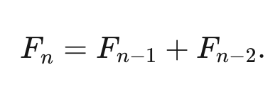
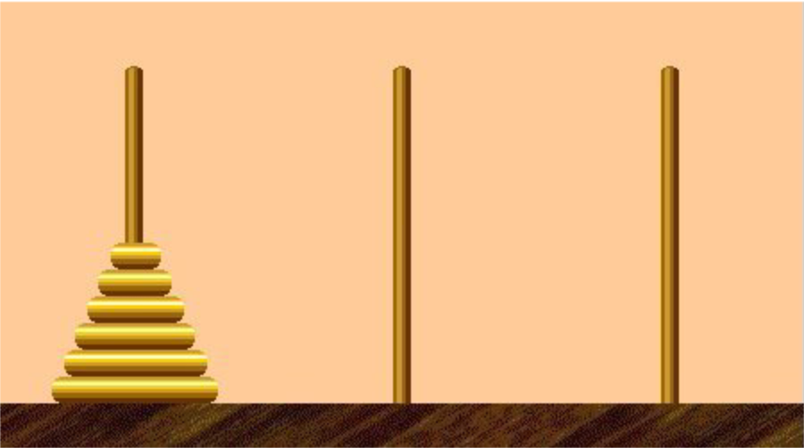

slidenumbers: true

# **Go** back2basics

### Learning **Go** language for programmer

---

# Why
### Going back to basics

I am fortunate enough to manage a team consists of eagerly learning programmers. 

My team currently consists of java programmers that interested to learn Go. I need material to expose Go 
to these programmers.

---

# What we're going to talk about

- Primitive Types
- Blocks, Shadows, and Control Structures
- Functions and Pointers
- Types, Methods, Interfaces
- Divide and Conquer

---

## Primitive Types
### Booleans

```go
var flag bool
var isRun = true

isStop := false
```

---

## Primitive Types
### Numeric Types

Go has a large number of numeric types, there are 12 different types.
These types are grouped into three categories.
- Integers
- Floating Point
- Complex types

---

## Primitive Types
### Integers

| Type Name | Value range |
|---|---|
|`int8`| -128 to 127 |
|`int16` | -32768 to 23767|
|`int32` | –2147483648 to 2147483647 |
|`int64` | –9223372036854775808 to 9223372036854775807 |
|`uint8` | 0 to 255 |
|`uint16`| 0 to 65536 |
|`uint32` | 0 to 4294967295 |
|`uint64` | 0 to 18446744073709551615 |

---

## Primitive Types
### Integers

**The special integer types**

`byte`

A `byte` is an alias for `uint8`; it is legal to assign, compare, or perform mathematical operations between a `byte` and an `uint8`.
Just, prefer use `byte`

---

`int` and `uint`

On a 32-bit CPU, `int` is a 32-bit signed integer like an `int32`.
On a 64-bit CPU, `int` is a 64-bit signed integer like an `int64`.

___

Because `int` isn't consistent from platform to platform, 
it is a compile time error to assign, compare, 
or perform mathematical operations between `int`
and `int32` or `int64` without type conversion.

**Integer literals default to being of `int` type**

___

## Primitive Types
### Floating points

|Type Name| Largest absolute value | Smallest (nonzero) absolute value |
|---|---|---|
|`float32`|3.40282346638528859811704183484516925440e+38|1.401298464324817070923729583289916131280e-45|
|`float64`|1.797693134862315708145274237317043567981e+308|4.940656458412465441765687928682213723651e-324|


---

## Primitive Types
### Complex types


---

## Primitive Types
### Explicit type Conversion

```go
var x int = 10
var y float64 = 30.2
var z float64 = float64(x) + y
var d int = x + int(y)
```

___

## Primitive Types
### `var` vs `:=`


Go has a lot of ways to declare variables. Each declaration style
communicates something about how the variable is used.

---

### Primitive Types
#### `var` vs `:=`

```go
var x int = 10
```
- The most verbose way to declare a variable in **Go**
- Using `var` keyword, and explicit type
- And an assignment

---

### Primitive Types
#### `var` vs `:=`

```go
var x = 10
```
- Leave off the type
  - Type implicitly an int, since the default type of integer literals is int

---

### Primitive Types
#### `var` vs `:=`

```go
var x int
```
- Declares variable x
- Type int
- Default zero value for integer

---

### Primitive Types
#### `var` vs `:=`

```go
var x, y int = 10, 20
var x, y int
var x, y = 10, "hello"
```

---

### Primitive Types
#### `var` vs `:=`

```go
var (
	x   int
	y       = 20
	z   int = 40
	d, y    = 40, "hello"
	f, g    string
)
```

---

### Primitive Types
#### `var` vs `:=`

Go supports a short declaration format. Use the `:=` operator 
to replace a `var` declaration that uses **type inference**.

```go
var x = 10
x := 0
```

```go
var x, y = 10, "hello"
x, y = 10, "hello"
```

---

### Primitive Types
#### `var` vs `:=`

With `:=` operator you can assign values to existing variables

```go
x := 10 
x, y := 30, "hello"
```

Operator `:=` cannot be used to declare variable at package level,
you must user `var` because `:=` is **not legal** outside functions.

---

### Primitive Types
#### `var` vs `:=`

### Choose what makes your intent clearest

---

- When initializing a variable to its zero value, use `var x int`
- When assigning an untyped constant or a literal to a variable and the default type for constant of literal isn't the type you want for the variable user the verbose long `var` style.

___

```go
// use 
var x byte = 20

// instead of 
x := byte(20)
```

---

- Because `:=` allows you to assign to both new and existing variables, it sometimes creates new variables when you think you are re-using ones.
  - Prefer use `var`, explicitly declare all of your new variables in it
  - Then use the assignment operator to assign values to both new and old variables

---

### Using const

---

## Composite Types
### Array

```go
var x[3] int
```

```go
var x = [3]int{10, 20, 30}
```

```go
var x = [12]int{1, 5: 4, 6, 10: 100, 15}
```

___

## Composite Types
### Array

When using an array literal to initialize an array, you can leave off the number.
Use `...` instead:

```go
var x = [...]int{10, 20, 30}
```
---
### Data Structures
A data structures is way of organizing data in a computer so that
it can be used effectively.

### Big O Notation

- `O(1)` - Executes in the same time regardless of the size of the input
- `O(n)` - Executes linearly and proportionally to the size of the input
- `O(n2)` - Performance is directly proportional to the square of the size of the input

---

### Comparing Arrays and Linked Lists

|   |Array|Linked List|
|---|---|----|
|Cost of accessing elements|O(1)|O(n)|
|Insert/Remove from beginning|O(n)|O(1)|
|Insert/Remove from end|O(1)|O(n)|
|Insert/Remove from middle|O(n)|O(n)|

___

## Composite Types
### Array

Go only has one-dimensional arrays, but we can simulate multidimensional arrays:

```go
var x [2][3] int
```

This declares `x` to be an array of length 2 whose type is an array of `ints` of length 3.

___

## Composite Types
### Slices

```go
var x = []int {10, 20, 30}
```
```go
var x = []int{1, 5: 4, 6, 10: 100, 15}
```
```go
var x [][]int
```
```go
data := []int {2, 4, 6, 8}
```

---

## Composite Types
### Slices
#### Append and Capacity

---

## Composite Types
### Slices
### Slicing Slices

---

## Composite Types
### Maps

```go
var nilMap map[inst]int
```

`nilMap` is declared to be a map with `string` keys and `int` values.
The zero value for a map is `nil`. A `nil` map has a length of `0`.

Reading a nil map always return nil.
Writing to a nil map causes panic.

---

## Composite Types
### Maps

```go
teams := map[string][]string {
    "Orcas": []string{"Fred", "Ralph", "Bijou"},
    "Lions": []string{"Sarah", "Peter", "Billie"},
    "Kittens": []string{"Waldo", "Raul", "Ze"},
}
```

---

## Composite Types
### Struct

- Maps are a convenient way to store some kinds of data.
- But they don't define an API since there is no way to constraint a map to only allow certain keys.
- Also  all the values in a map must be of the same type.

```go
type person struct {
	name string
	age int
	pet string
}
```

---

## Composite Types
### Struct

Declaring `struct`

```go
var fred person

bob := person{} // struct literal

julia := person {
	"Julia", 
	40,
	"cat",
}
```

----

```go
beth := person {
	age: 30,
	name: "Beth",
}
```

___

Anonymous struct

```go
var person struct {
    name string
    age  int
    pet  string
}

person.name = "bob"
person.age = 50
person.pet = "dog"

pet := struct {
    name string
    kind string
}{
    name: "Fido",
    kind: "dog",
}
```

---

## Composite Types
### Struct

Go doesn't allow comparisons between variables that represents structs of different types.
Go does allow a type conversion from one struct type to another *if the fields of both structs have the same names, order, and types*.


___
## Blocks, Shadows, and Control Structures

---
### Blocks

- Places where a declaration occurs called a *block*.
- Variables, constants, types, and function declared outside of any functions are placed in the *package* block
- File block is variables, constants, types, and function declared inside a file defined by an import statement
- Within a function, every set of braces `{}` defines another block.

---
### Shadowing variables

---
### If

```go
n := rand.Intn(10)
if n == 0 {
    fmt.Println("That's too low")
} else if n > 5 {
    fmt.Println("That's too big:", n)
} else {
    fmt.Println("That's a good number:", n)
}
```

---
### If
Scoping a variable to an `if` statement

```go
if n := rand.Intn(10); n == 0 {
fmt.Println("That's too low")
} else if n > 5 {
fmt.Println("That's too big:", n)
} else {
fmt.Println("That's a good number:", n)
}
// n is out of scope
fmt.Pritnln(n)
```
Attemting to run this code produces a compilation error:

`undefined: n`

---
### for, Four ways

- A complete C-style `for`

```go
for i := 0; i < 10; i++ {
    fmt.Println(i)
}
```

---
- A condition only `for`

```go
i := 1
for i < 100 {
	fmt.Println(i)
	i = i * 2
}
```

---
- An infinite `for`

```go
for {
	fmt.Println("Hello")
}
```

---
- `for-range`

```go
evenVals := []int{2, 4, 6, 8, 10, 12}
for i, v := range evenVals {
fmt.Println(i, v)
}
```

- The `for-range` value is a copy. *Modifying the value variable will not modify the value in the compound type*.

---
### Switch

Go makes `switch` statement useful.

```go
words := []string{"a", "cow", "smile", "gopher",
    "octopus", "anthropologist"}
for _, word := range words {
    switch size := len(word); size {
    case 1, 2, 3, 4:
        fmt.Println(word, "is a short word!")
    case 5:
        wordLen := len(word)
        fmt.Println(word, "is exactly the right length:", wordLen)
    case 6, 7, 8, 9:
    default:
        fmt.Println(word, "is a long word!")
    }
}
```

---
```go
for i := 0; i < 10; i++ {
    switch {
    case i%2 == 0:
        fmt.Println(i, "is even")
    case i%3 == 0:
        fmt.Println(i, "is divisible by 3 but not 2")
    case i%7 == 0:
        fmt.Println("exit the loop!")
        break
    default:
        fmt.Println(i, "is boring")
    }
}
```

Go would assume you want to break from `switch` statement. You can add label in your break.

---
```go
loop:
for i := 0; i < 10; i++ {
    switch {
    case i%2 == 0:
        fmt.Println(i, "is even")
    case i%3 == 0:
        fmt.Println(i, "is divisible by 3 but not 2")
    case i%7 == 0:
        fmt.Println("exit the loop!")
        break loop
    default:
        fmt.Println(i, "is boring")
    }
}
```

---
```go
words := []string{"hi", "salutations", "hello"}
for _, word := range words {
    switch wordLen := len(word); {
    case wordLen < 5:
        fmt.Println(word, "is a short word!")
    case wordLen > 10:
        fmt.Println(word, "is a long word!")
    default:
        fmt.Println(word, "is exactly the right length.")
    }
}
```

---
```go
switch {
case a == 2:
    fmt.Println("a is 2")
case a == 3:
    fmt.Println("a is 3")
case a == 4:
    fmt.Println("a is 4")
default:
    fmt.Println("a is ", a)
}
```

For clarity, you should replace with as follows:

---

```go
switch a {
case 2:
    fmt.Println("a is 2")
case 3:
    fmt.Println("a is 3")
case 4:
    fmt.Println("a is 4")
default:
    fmt.Println("a is ", a)
}
```
---
## Functions

```go
func div(numerator int, denominator int) int {
    if denominator == 0 {
        return 0
    }
    return numerator / denominator
}
```

```go
result := div(5, 2)
fmt.Println(result)
```

--- 
## Functions
### Variadic Input Parameters and Slices

```go
func addTo(base int, vals ...int) []int {
    out := make([]int, 0, len(vals))
    for _, v := range vals {
        out = append(out, base+v)
    }
    return out
}
```

---
## Functions
### Multiple return values

```go
func divAndRemainder(numerator int, denominator int) (int, int, error) {
    if denominator == 0 {
        return 0, 0, errors.New("cannot divide by zero")
    }
    return numerator / denominator, numerator % denominator, nil
}
```

--- 
## Functions
### Functions are values

---
## Function Type Declarations

```go
type opFuncType func(int, int, int) int
```

```go
var opMap = map[string]opFuncType {
    // same as before
}
```

---
## Anonymous Functions

```go
ffunc main() {
    for i := 0; i < 5; i++ {
        func(j int) {
            fmt.Println("printing", j, "from inside of an anonymous function")
        }(i)
    }
}
```

---
## Closure

- Functions declared inside a functions is called Closure
- Closure suggest that functions declared inside of function are able to access and modify variables declared in the outer function
- Closures become interesting when passed to other functions or returned from other functions.

---
## Passing Functions as Parameters

---
## Functions returns functions

---
## defer

- Programs often create temporary resources, like files, or network connections that need to be clean up.
- In go, the cleanup code is attached to the function with the `defer` keyword.

---
Ex:

```go
func main() {
    if len(os.Args) < 2 {
        log.Fatal("no file specified")
    }
    f, err := os.Open(os.Args[1])
    if err != nil {
        log.Fatal(err)
    }
    defer f.Close()
    data := make([]byte, 2048)
    for {
        count, err := f.Read(data)
        os.Stdout.Write(data[:count])
        if err != nil {
            if err != io.EOF {
                log.Fatal(err)
            }
            break
        }
    }
}
```

---
## Defer using closure

```go
func getFile(name string) (*os.File, func(), error) {
    file, err := os.Open(name)
    if err != nil {
        return nil, nil, err
    }
    return file, func() {
        file.Close()
    }, nil
}
```

```go
f, closer, err := getFile(os.Args[1])
if err != nil {
    log.Fatal(err)
}
defer closer()
```

---
### Pointers

Declaration

```go
var x int32 = 10
var y bool = true
pointerX := &x
pointerY := &y
var pointerZ *string
```

---
## Pointers

The `&` is the address operator.

```go
x := "hello"
pointerToX := &x
```

The `*` is the indirection operator

```go
x := 10
pointerToX := &x
fmt.Println(pointerToX)  // prints a memory address
fmt.Println(*pointerToX) // prints 10
z := 5 + *pointerToX
fmt.Println(z) 
```

---
## Types, Methods, and Interfaces
### Types in Go

```go
type Person struct {
	FirstName string
	LastName string
	Age int
}
```

- Declaring user-defined type with the name `Person` to have the *underlying type* of the struct literal that follows.

---
### Types in Go

In addition to struct literals, you can use any primitive type or compound type literal to define a concrete type.

```go
type Score int
type Converter func(string)Score
type TeamScores map[string]Score
```

---
### Methods

```go
type Person struct {
    FirstName string
    LastName string
    Age int
}

func (p Person) String() string {
    return fmt.Sprintf("%s %s, age %d", p.FirstName, p.LastName, p.Age)
}
```
- Method declaration look just like function declarations, except, the *receiver* specification.

---
### Pointer receivers and value receivers

- Go uses parameters of pointer type to indicate that parameter might be modified by the function.
- They can be pointer receivers (the type is pointer) or value receivers.

Rule of thumbs:
- If your method modifies the receiver, you must use a pointer receiver
- If your method needs to handle `nil` instances, then it must use a pointer receiver
- If your method doesn't modify the receiver, you can use value receiver.

---
### Pointer receivers and value receivers

```go
type Counter struct {
    total             int
    lastUpdated time.Time
}

func (c *Counter) Increment() {
    c.total++
    c.lastUpdated = time.Now()
}

func (c Counter) String() string {
    return fmt.Sprintf("total: %d, last updated: %v", c.total, c.lastUpdated)
}
```

---
### Code your methods for nil instances

```go
type IntTree struct {
    val         int
    left, right *IntTree
}

func (it *IntTree) Insert(val int) *IntTree {
    if it == nil {
        return &IntTree{val: val}
    }
    if val < it.val {
        it.left = it.left.Insert(val)
    } else if val > it.val {
        it.right = it.right.Insert(val)
    }
    return it
}

func (it *IntTree) Contains(val int) bool {
    switch {
    case it == nil:
        return false
    case val < it.val:
        return it.left.Contains(val)
    case val > it.val:
        return it.right.Contains(val)
    default:
        return true
    }
}
```

---
### Methods are functions too

---
### Use Embedding for Compositions

```go
type Employee struct {
    Name         string
    ID           string
}

func (e Employee) Description() string {
    return fmt.Sprintf("%s (%s)", e.Name, e.ID)
}

type Manager struct {
    Employee
    Reports []Employee
}

func (m Manager) FindNewEmployees() []Employee {
    // do business logic
}
```
---
### Linked List

```go
type LinkedList struct {
	Head *Node
	Tail *Node
}

type Node struct {
	Next *Node
	Data interface{}
}
```

---
### Linked List
**Operation**
Create new linked list object

```go
func New() *LinkedList {
	emptyNode := &Node{
	    Next: nil,
	    Data: nil,
    }
    
    return &LinkedList{
        Head: emptyNode,
        Tail: emptyNode,
    }
}
```

---
### Linked List
**Operation**
Create Method to append data to a linked list

```go
func (l *LinkedList) Append(d interface{}) *LinkedList {
	newNode := &Node{
	    Next: nil,
	    Data: d,
    }
    
    // Empty linked list
    if l.Head.Data == nil {
    	l.Head = newNode
    } else {
        l.Tail.Next = newNode	
    }
    
    l.Tail = newNode
    
    return l
}
```

---
### Linked List
** Operation**
Remove a value in a linked list

```go
func (l *LinkedList) DeleteWithValue(v interface{}) *LinkedList {
	var node = l.Head
	if reflect.DeepEqual(node.Data, v) {
		l.Head = l.Head.Next
		return l
    }
    
    for {
        if reflect.DeepEqual(v, node.Next.Data) {
        	node.Next = node.Next.Next
        	return l
        }
        node = node.Next
    }
    return l
}
```

---
### Linked List
**Operation**
Print all element of the linked list

```go
func(l *LinkedList) PrintAll() {
	var node = l.Head
	for {
		fmt.Println(node.Data)
		if node.Next == nil {
		    return	
        }
        node = node.Next
    }
}
```

---
### Use Embedding for compositions

- `Manager` contains a field of the type `Employee`, but no name is assigned to that field.
- This makes `Employee` an `embedded field`. Any fields or methods declared on an embedded field are *promoted* to the containing struct and can be invoked directly on it.

---
### Use Embedding for compositions

```go
m := Manager{
    Employee: Employee{
        Name:         "Bob Bobson",
        ID:             "12345",
    },
    Reports: []Employee{},
}
fmt.Println(m.ID)            // prints 12345
fmt.Println(m.Description()) // prints Bob Bobson (12345)
```

---
### Embedding is not inheritance

```go
var eFail Employee = m        // compilation error!
var eOK Employee = m.Employee // ok!
```

- You cannot assign a variable of type `Manager` to a variable of type `Employee`.

---
### Interface

```go
type Stringer interface {
	String() string
}
```

---
### Interface

- Interfaces are implicitly implemented
- A concrete type does not declare that it implements an interface.
  - If the method set for a concrete type contains all of the methods in the method set for an interface, then the concrete type implements the interface.

---
### Accept interfaces, return structs

The business logic invoked by your functions should be invoked via interfaces, but the outptu of your functions should be a concrete type.

---
### Empty interface

```go
var i interface{}
i = 20
i = "hello"
i = struct {
    FirstName string
    LastName string
} {"Fred", "Fredson"}
```

- An empty interface type simply states that the variable can store any value whose type implements zero or more methods.
- This just happens to match every type in Go.

---
```go
/ one set of braces for the interface{} type,
// the other to instantiate an instance of the map
data := map[string]interface{}{}
contents, err := ioutil.ReadFile("testdata/sample.json")
if err != nil {
    return err
}
defer contents.Close()
json.Unmarshal(contents, &data)
// the contents are now in the data map
```

---
```go
type LinkedList struct {
    Value interface{}
    Next    *LinkedList
}

func (ll *LinkedList) Insert(pos int, val interface{}) *LinkedList {
    if ll == nil || pos == 0 {
        return &LinkedList{
            Value: val,
            Next:    ll,
        }
    }
    ll.Next = ll.Next.Insert(pos-1, val)
    return ll
}
```

---
### Type assertion

```go
type MyInt int

func main() {
var i interface{}
var mine MyInt = 20
i = mine
i2 := i.(MyInt)
fmt.Println(i2 + 1)
}
```

---
### Type assertion

```go
i2, ok := i.(int)
if !ok {
    return fmt.Errorf("unexpected type for %v",i)
}
fmt.Println(i2 + 1)
```

---
### Type switch

```go
func doThings(i interface{}) {
    switch j := i.(type) {
    case nil:
        // i is nil, type of j is interface{}
    case int:
        // j is of type int
    case MyInt:
        // j is of type MyInt
    case io.Reader:
        // j is of type io.Reader
    case string:
        // j is a string
    case bool, rune:
        // i is either a bool or rune, so j is of type interface{}
    default:
        // no idea what i is, so j is of type interface{}
    }
}
```

---
```go
// copyBuffer is the actual implementation of Copy and CopyBuffer.
// if buf is nil, one is allocated.
func copyBuffer(dst Writer, src Reader, buf []byte) (written int64, err error) {
    // If the reader has a WriteTo method, use it to do the copy.
    // Avoids an allocation and a copy.
    if wt, ok := src.(WriterTo); ok {
        return wt.WriteTo(dst)
    }
    // Similarly, if the writer has a ReadFrom method, use it to do the copy.
    if rt, ok := dst.(ReaderFrom); ok {
        return rt.ReadFrom(src)
    }
    // function continues...
}
```

---
### Function types are a bridge to interfaces

```go
type Handler interface {
    ServeHTTP(http.ResponseWriter, *http.Request)
}
```

```go
type HandlerFunc func(http.ResponseWriter, *http.Request)

func (f HandlerFunc) ServeHTTP(w http.ResponseWriter, r *http.Request) {
    f(w, r)
}
```

---
## Recursion
### Fibonacci



---
## Divide and Conquer
The goal of DAC is to:
- **Divide ** a problem into smaller sized sub-problems recursively
- **Conquer** each problem separately, solving them recursively
- **Combine** results

---
### Tower of Hanoi
Every disk is stacked on top of disks that are strictly larger than it. Disks are moved one at a time from the top of one tower to top of another, and they can't be placed anywhere other than the three towers. Additionally, disks must always be stacked on an empty tower or on top of larger disks. The goal of the puzzle is to, by a sequence of disk moves, end up with the disks stacked on some other tower.

---


---
### Quicksort

---

### What is RESTful

REST - Representational State Transfer --> Roy Fielding, desertasi dia.

- Stateless
- Content negotiation - header (Content-type, accept)
- URI- URI template
  - `{base-url}/v1/cif/products` - resource definition
  - Method - GET, POST, PUT, PATCH, DELETE
    - GET - Ngambil resource
    - POST - Create resource
    - PUT - update resource
    - PATH - update resource
    - DELETE - remove resource
  - GET - URI Param
    - request content-type = application/json, request accept = application/json, response = application/json

```json
{
  "resource_id": "1234",
  "message_id": "12",
  "message": "asdfadfadsf",
  "data": {}
}
```    

      - `{base-url}/v1/cif/products/:id` - implicit unique, balikin object
      - `{base-url}/v1/cif/products/:email` - implicit unique, balikin object
      - `{base-url}/v1/cif/products/:name` - implicit not-unique, balikin array of objects
      - `{base-url}/v1/cif/categories/:id` - implicit unique, balikin object
      - `{base-url}/v1/cif/products/:catid` - implicit not-unique, balikin array of objects
  - GET - Query Param
    - `{base-url}/v1/cif/products/:name?fname=bila&lname=muhammad` - balikin array of objects 
  - POST 
    - `{base-url}/v1/cif/products`
      - Header - content-type application/json
  - PUT
    - `{base-url}/v1/cif/products/:id`
      - Request kirim object yang mau di-update minus id
        - implicitly object
    - `{base-url}/v1/bulk/cif/`
  - PATCH `{base-uri}/v1/cif/products/:id`
    - Request kirim hanya data yang pingin diupdate
  - DELETE `{base-uri}/v1/cif/products/:id`
  - Intent intuitively shown on the uri and http method
    - shared language and shared design consideration

[List of HTTP status Code](https://en.wikipedia.org/wiki/List_of_HTTP_status_codes#2xx_success) 

# Introduction to Gin-gonic

`gin.Engine` dan `gin.Context`

[Document gin-gonic](https://github.com/gin-gonic/gin)